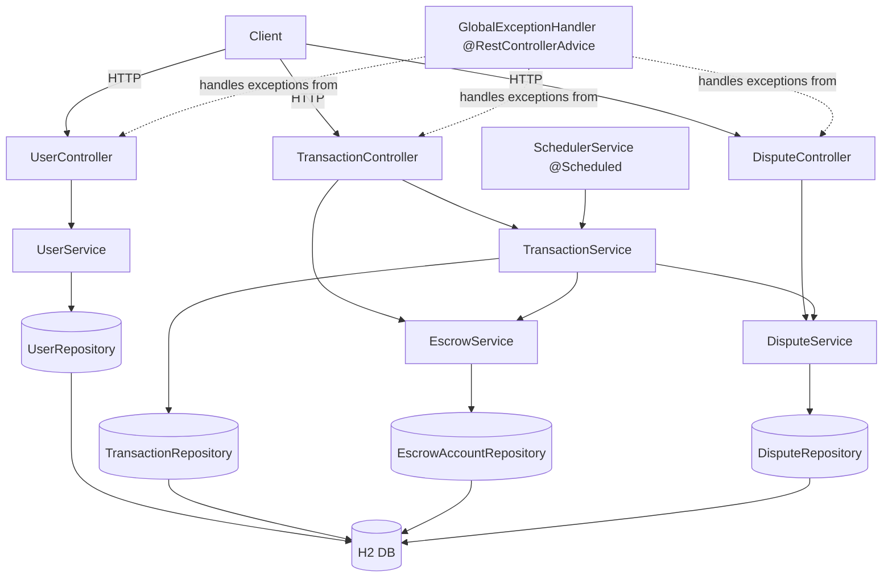
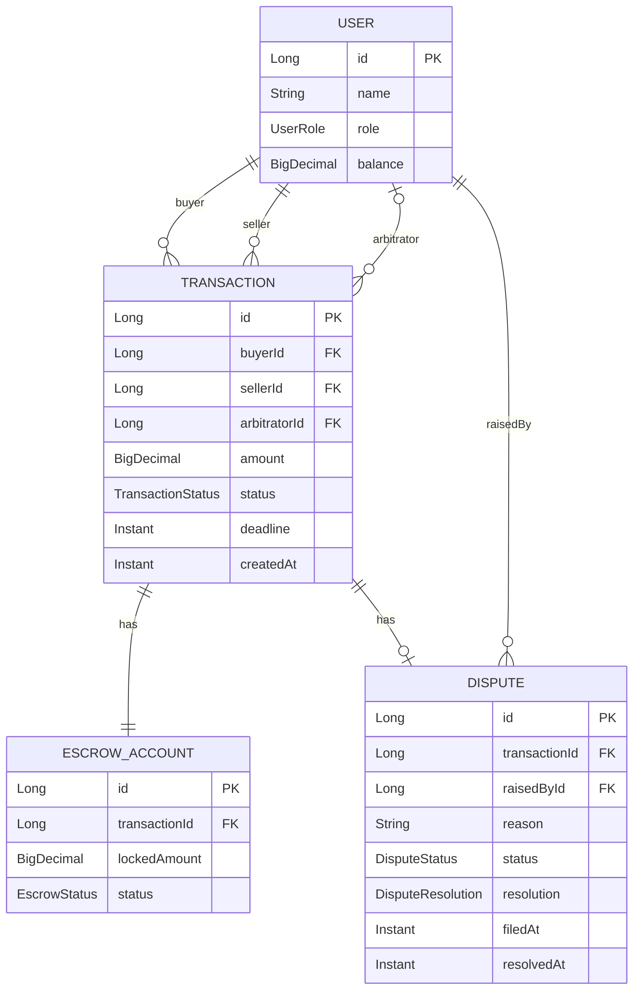
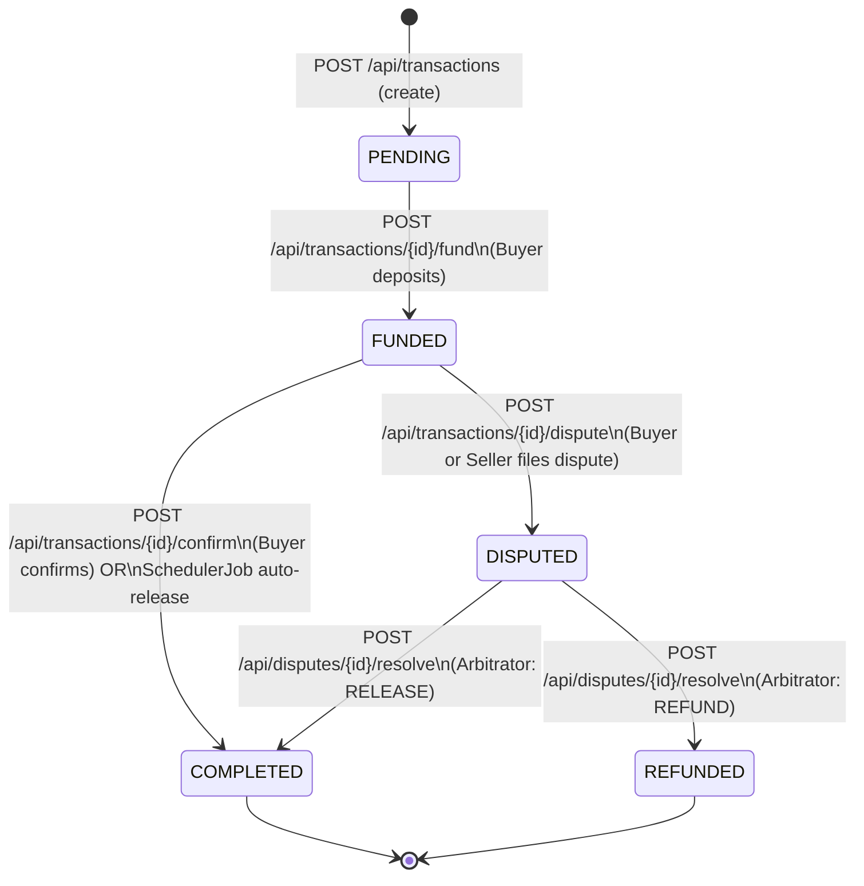

# Design Document

## Java Escrow System

---

## Overview

The Java Escrow System is a Spring Boot REST application that brokers secure financial transactions between two parties (Buyer and Seller), optionally supervised by a third party (Arbitrator). Funds are simulated as virtual balances stored in an H2 in-memory database. The system holds funds in a locked `EscrowAccount` until one of three release conditions is met:

1. The Buyer explicitly confirms delivery (manual release).
2. The auto-release deadline passes without a dispute (scheduler release).
3. An Arbitrator resolves a filed dispute (arbitrated release).

The application exposes a pure REST API with no authentication. All state mutations are protected by `@Transactional` boundaries to guarantee atomicity. A Spring `@Scheduled` background job runs every 60 seconds to process overdue, undisputed funded transactions.

**Key design goals:**
- Strict lifecycle enforcement — every `Transaction` follows a defined state machine; invalid transitions are rejected.
- Balance conservation — the sum of all user balances and all locked escrow amounts must equal the sum of all initial user balances at all times.
- Atomicity — every multi-step mutation (fund, confirm, dispute, resolve, auto-release) succeeds or rolls back entirely.
- Simplicity — no authentication, no external dependencies beyond Spring Boot and H2.

---

## Architecture

The application follows a classic three-tier layered architecture:

```
┌──────────────────────────────────────────────────────┐
│                   REST Layer (Controllers)            │
│  UserController  TransactionController  DisputeCtrl  │
└─────────────────────┬────────────────────────────────┘
                      │ calls
┌─────────────────────▼────────────────────────────────┐
│                 Service Layer                        │
│  UserService  TransactionService  DisputeService     │
│  EscrowService  SchedulerService                     │
└─────────────────────┬────────────────────────────────┘
                      │ uses
┌─────────────────────▼────────────────────────────────┐
│              Repository Layer (Spring Data JPA)      │
│  UserRepository  TransactionRepository               │
│  EscrowAccountRepository  DisputeRepository          │
└─────────────────────┬────────────────────────────────┘
                      │ persists to
┌─────────────────────▼────────────────────────────────┐
│               H2 In-Memory Database                  │
│         (schema created on startup, dropped          │
│          on shutdown via create-drop DDL)            │
└──────────────────────────────────────────────────────┘
```



### Layer Responsibilities

| Layer | Responsibility |
|---|---|
| **Controller** | Request parsing, input validation (Bean Validation), HTTP response mapping |
| **Service** | Business logic, state machine enforcement, balance operations, `@Transactional` boundaries |
| **Repository** | Spring Data JPA interfaces — CRUD and custom query methods |
| **Scheduler** | Time-driven auto-release logic, runs every 60 seconds |
| **Exception Handler** | Global `@RestControllerAdvice` — maps domain exceptions to HTTP error responses |

---

## Components and Interfaces

### Controllers

#### `UserController` — `/api/users`

| Method | Path | Description |
|---|---|---|
| `POST` | `/api/users` | Create a new User |
| `GET` | `/api/users` | List all Users |
| `GET` | `/api/users/{id}` | Get a User by ID |

#### `TransactionController` — `/api/transactions`

| Method | Path | Description |
|---|---|---|
| `POST` | `/api/transactions` | Create a new Transaction (status: PENDING) |
| `GET` | `/api/transactions/{id}` | Get a Transaction by ID |
| `GET` | `/api/transactions?userId={id}` | List Transactions involving a User |
| `POST` | `/api/transactions/{id}/fund` | Buyer funds the escrow (PENDING → FUNDED) |
| `POST` | `/api/transactions/{id}/confirm` | Buyer confirms delivery (FUNDED → COMPLETED) |
| `POST` | `/api/transactions/{id}/dispute` | Buyer or Seller files a dispute (FUNDED → DISPUTED) |

#### `DisputeController` — `/api/disputes`

| Method | Path | Description |
|---|---|---|
| `GET` | `/api/disputes` | List all Disputes |
| `GET` | `/api/disputes/{id}` | Get a Dispute by ID |
| `POST` | `/api/disputes/{id}/resolve` | Arbitrator resolves a Dispute (RELEASE or REFUND) |

### Services

#### `UserService`
- `createUser(CreateUserRequest)` — validates and persists a new User
- `getAllUsers()` — returns all Users
- `getUserById(Long id)` — returns a User or throws `UserNotFoundException`

#### `TransactionService`
- `createTransaction(CreateTransactionRequest)` — validates roles, amount, deadline; creates PENDING Transaction
- `getTransactionById(Long id)` — returns Transaction or throws `TransactionNotFoundException`
- `getTransactionsByUserId(Long userId)` — returns all Transactions where user is Buyer, Seller, or Arbitrator
- `fundTransaction(Long txId, Long requestingUserId)` — enforces PENDING status, sufficient balance; creates EscrowAccount; deducts Buyer balance; sets FUNDED
- `confirmTransaction(Long txId, Long requestingUserId)` — enforces FUNDED status, Buyer identity; releases escrow to Seller; sets COMPLETED
- `fileDispute(Long txId, Long raisedByUserId, String reason)` — enforces FUNDED status, deadline not passed, valid raiser; creates OPEN Dispute; sets DISPUTED
- `autoRelease(Transaction tx)` — scheduler-invoked release for eligible transactions

#### `EscrowService`
- `createEscrow(Transaction tx, BigDecimal amount)` — creates a LOCKED EscrowAccount
- `releaseEscrow(EscrowAccount escrow, User recipient)` — credits recipient balance; sets escrow status to RELEASED
- `refundEscrow(EscrowAccount escrow, User buyer)` — credits buyer balance; sets escrow status to RELEASED

#### `DisputeService`
- `createDispute(Transaction tx, User raisedBy, String reason)` — creates OPEN Dispute
- `resolveDispute(Long disputeId, DisputeResolution resolution)` — validates state; applies RELEASE or REFUND; sets all statuses
- `getAllDisputes()` — returns all Disputes
- `getDisputeById(Long id)` — returns Dispute or throws `DisputeNotFoundException`

#### `SchedulerService`
- `@Scheduled(fixedDelay = 60000)` — queries for eligible Transactions; calls `TransactionService.autoRelease()` for each

### Repositories

```java
interface UserRepository extends JpaRepository<User, Long>

interface TransactionRepository extends JpaRepository<Transaction, Long> {
    List<Transaction> findByBuyerIdOrSellerIdOrArbitratorId(Long b, Long s, Long a);
    List<Transaction> findByStatusAndDeadlineBefore(TransactionStatus status, Instant deadline);
}

interface EscrowAccountRepository extends JpaRepository<EscrowAccount, Long> {
    Optional<EscrowAccount> findByTransactionId(Long txId);
}

interface DisputeRepository extends JpaRepository<Dispute, Long> {
    Optional<Dispute> findByTransactionId(Long txId);
    boolean existsByTransactionIdAndStatusIn(Long txId, List<DisputeStatus> statuses);
}
```

### Request/Response DTOs

**CreateUserRequest**
```java
String name;         // @NotBlank, @Size(max = 100)
UserRole role;       // @NotNull — BUYER | SELLER | ARBITRATOR
BigDecimal balance;  // @NotNull, @DecimalMin("0.00"), @DecimalMax("999999999.99")
```

**CreateTransactionRequest**
```java
Long buyerId;        // @NotNull
Long sellerId;       // @NotNull
Long arbitratorId;   // optional
BigDecimal amount;   // @NotNull, @DecimalMin("0.01"), @DecimalMax("999999999.99")
Instant deadline;    // @NotNull, must be > now + 1 minute (custom validator)
```

**FundTransactionRequest**
```java
Long requestingUserId; // @NotNull
```

**ConfirmTransactionRequest**
```java
Long requestingUserId; // @NotNull
```

**FileDisputeRequest**
```java
Long raisedByUserId; // @NotNull
String reason;       // @NotBlank, @Size(max = 1000)
```

**ResolveDisputeRequest**
```java
DisputeResolution resolution; // @NotNull — RELEASE | REFUND
```

---

## Data Models

### Entity Relationship Diagram



### Entity Definitions

#### `User`
```java
@Entity
@Table(name = "users")
public class User {
    @Id @GeneratedValue(strategy = GenerationType.IDENTITY)
    private Long id;

    @Column(nullable = false, length = 100)
    private String name;

    @Enumerated(EnumType.STRING)
    @Column(nullable = false)
    private UserRole role;       // BUYER | SELLER | ARBITRATOR

    @Column(nullable = false, precision = 15, scale = 2)
    private BigDecimal balance;
}
```

#### `Transaction`
```java
@Entity
@Table(name = "transactions")
public class Transaction {
    @Id @GeneratedValue(strategy = GenerationType.IDENTITY)
    private Long id;

    @ManyToOne(optional = false)
    private User buyer;

    @ManyToOne(optional = false)
    private User seller;

    @ManyToOne
    private User arbitrator;     // nullable

    @Column(nullable = false, precision = 15, scale = 2)
    private BigDecimal amount;

    @Enumerated(EnumType.STRING)
    @Column(nullable = false)
    private TransactionStatus status;  // PENDING | FUNDED | COMPLETED | REFUNDED | DISPUTED

    @Column(nullable = false)
    private Instant deadline;

    @Column(nullable = false, updatable = false)
    private Instant createdAt;
}
```

#### `EscrowAccount`
```java
@Entity
@Table(name = "escrow_accounts")
public class EscrowAccount {
    @Id @GeneratedValue(strategy = GenerationType.IDENTITY)
    private Long id;

    @OneToOne(optional = false)
    private Transaction transaction;

    @Column(nullable = false, precision = 15, scale = 2)
    private BigDecimal lockedAmount;

    @Enumerated(EnumType.STRING)
    @Column(nullable = false)
    private EscrowStatus status;   // LOCKED | RELEASED
}
```

#### `Dispute`
```java
@Entity
@Table(name = "disputes")
public class Dispute {
    @Id @GeneratedValue(strategy = GenerationType.IDENTITY)
    private Long id;

    @OneToOne(optional = false)
    private Transaction transaction;

    @ManyToOne(optional = false)
    private User raisedBy;

    @Column(nullable = false, length = 1000)
    private String reason;

    @Enumerated(EnumType.STRING)
    @Column(nullable = false)
    private DisputeStatus status;       // OPEN | IN_PROGRESS | RESOLVED

    @Enumerated(EnumType.STRING)
    private DisputeResolution resolution;  // RELEASE | REFUND (nullable until resolved)

    @Column(nullable = false, updatable = false)
    private Instant filedAt;

    private Instant resolvedAt;          // nullable until resolved
}
```

### Enumerations

```java
enum UserRole           { BUYER, SELLER, ARBITRATOR }
enum TransactionStatus  { PENDING, FUNDED, COMPLETED, REFUNDED, DISPUTED }
enum EscrowStatus       { LOCKED, RELEASED }
enum DisputeStatus      { OPEN, IN_PROGRESS, RESOLVED }
enum DisputeResolution  { RELEASE, REFUND }
```

### Transaction State Machine

The following state machine is the canonical lifecycle of a `Transaction`. **Only these transitions are permitted** — all others must be rejected with an error.



**Permitted transitions table:**

| From | To | Trigger |
|---|---|---|
| PENDING | FUNDED | `fundTransaction` |
| FUNDED | COMPLETED | `confirmTransaction` or scheduler auto-release |
| FUNDED | DISPUTED | `fileDispute` |
| DISPUTED | COMPLETED | `resolveDispute(RELEASE)` |
| DISPUTED | REFUNDED | `resolveDispute(REFUND)` |

### Scheduler Design

The `SchedulerService` runs a `@Scheduled(fixedDelay = 60_000)` method. `fixedDelay` (not `fixedRate`) is used intentionally so that the next execution begins 60 seconds **after** the previous execution completes, preventing overlapping runs.

**Eligibility criteria for a Transaction to be auto-released:**
1. `status == FUNDED`
2. `deadline < Instant.now()` (strictly less than — deadline has passed)
3. No `Dispute` with `status IN (OPEN, IN_PROGRESS)` linked to the transaction

**Scheduler flow:**
```
1. Query TransactionRepository for all FUNDED transactions with deadline < now()
2. For each candidate transaction:
   a. Check DisputeRepository: does an OPEN or IN_PROGRESS dispute exist?
   b. If no → call TransactionService.autoRelease(tx) within a @Transactional boundary
   c. If yes → skip (log at DEBUG level)
3. Log any per-transaction errors with the Transaction ID; continue to next
```

**Idempotency**: The `FUNDED → COMPLETED` transition in `autoRelease` is guarded by a status check inside the transaction. If a transaction is already `COMPLETED` when the scheduler attempts to process it (e.g., due to a race with Buyer confirmation), the guard will reject the operation, preventing double-release.

---

## Correctness Properties

*A property is a characteristic or behavior that should hold true across all valid executions of a system — essentially, a formal statement about what the system should do. Properties serve as the bridge between human-readable specifications and machine-verifiable correctness guarantees.*

### Property 1: Valid User Creation Round-Trip

*For any* valid (name, role, balance) triple where name is non-blank with ≤ 100 characters, role is one of {BUYER, SELLER, ARBITRATOR}, and balance is in [0.00, 999,999,999.99], creating a User via POST and then retrieving it by ID shall return a User with the same name, role, and balance.

**Validates: Requirements 1.1, 1.7**

---

### Property 2: Blank Name Rejection

*For any* string composed entirely of whitespace characters (including empty string), a POST to `/api/users` with that string as the name shall return HTTP 400 and create no User record.

**Validates: Requirements 1.2**

---

### Property 3: New Transactions Always Start as PENDING

*For any* valid transaction creation request (valid buyer, seller, amount in range, deadline at least 1 minute in the future), the created Transaction shall have status PENDING and the amount shall equal the requested amount.

**Validates: Requirements 2.1, 9.5**

---

### Property 4: Transaction Lookup Round-Trip

*For any* created Transaction, a GET request to `/api/transactions/{id}` shall return a Transaction record with the same buyerId, sellerId, amount, deadline, and status as the created Transaction.

**Validates: Requirements 2.10**

---

### Property 5: User Transaction Filter Completeness

*For any* user U and any set of transactions T, GET `/api/transactions?userId={U.id}` shall return exactly the subset of T in which U is the Buyer, Seller, or Arbitrator — no more and no fewer.

**Validates: Requirements 2.12**

---

### Property 6: Funding Produces Correct State Changes

*For any* PENDING Transaction where the Buyer's balance is greater than or equal to the Transaction amount, after a successful fund operation: (a) the Buyer's balance decreases by exactly the Transaction amount, (b) an EscrowAccount with lockedAmount equal to the Transaction amount and status LOCKED is created, and (c) the Transaction status becomes FUNDED.

**Validates: Requirements 3.1**

---

### Property 7: Insufficient Funds Leaves All State Unchanged

*For any* Transaction where the Buyer's balance is strictly less than the Transaction amount, a fund request shall return HTTP 400, and the Buyer's balance, Transaction status, and EscrowAccount state shall remain identical to their state before the request.

**Validates: Requirements 3.2**

---

### Property 8: Buyer Confirmation Transfers Escrow to Seller

*For any* FUNDED Transaction with a LOCKED EscrowAccount of amount A, after the Buyer successfully confirms the transaction: (a) the Seller's balance increases by exactly A, (b) the EscrowAccount status becomes RELEASED, and (c) the Transaction status becomes COMPLETED.

**Validates: Requirements 4.1, 9.6**

---

### Property 9: Scheduler Eligibility Correctness

*For any* collection of Transactions with mixed statuses, deadlines, and dispute states, the set of Transactions selected by the scheduler for auto-release shall consist of exactly those Transactions that are simultaneously FUNDED, have a deadline strictly before the current timestamp, and have no associated Dispute with status OPEN or IN_PROGRESS.

**Validates: Requirements 5.1, 6.7**

---

### Property 10: Scheduler Auto-Release Idempotence

*For any* single scheduler execution cycle, each eligible Transaction shall be processed at most once — repeated invocation of the auto-release logic on a Transaction that has already been COMPLETED in the same run shall be a no-op and shall not alter any balance or escrow state.

**Validates: Requirements 5.6**

---

### Property 11: Dispute Filing Produces Correct Initial State

*For any* FUNDED Transaction whose deadline is strictly in the future, when a Buyer or Seller files a dispute with a non-blank reason of ≤ 1000 characters: (a) a Dispute record with status OPEN is created, and (b) the Transaction status becomes DISPUTED.

**Validates: Requirements 6.1**

---

### Property 12: RELEASE Resolution Credits Seller

*For any* Dispute linked to a DISPUTED Transaction with a LOCKED EscrowAccount of amount A, after an Arbitrator resolves with RELEASE: (a) the Seller's balance increases by exactly A, (b) the EscrowAccount status becomes RELEASED, (c) the Transaction status becomes COMPLETED, and (d) the Dispute status becomes RESOLVED with resolution RELEASE.

**Validates: Requirements 7.1**

---

### Property 13: REFUND Resolution Credits Buyer

*For any* Dispute linked to a DISPUTED Transaction with a LOCKED EscrowAccount of amount A, after an Arbitrator resolves with REFUND: (a) the Buyer's balance increases by exactly A, (b) the EscrowAccount status becomes RELEASED, (c) the Transaction status becomes REFUNDED, and (d) the Dispute status becomes RESOLVED with resolution REFUND.

**Validates: Requirements 7.2**

---

### Property 14: Valid State Machine Transitions Only

*For any* Transaction in any valid status, only the permitted transitions listed in the state machine shall succeed; every other state-mutating operation on that Transaction shall be rejected with an HTTP error (400, 403, 409, or 422) and shall leave the Transaction status unchanged.

**Validates: Requirements 9.1, 9.2**

---

### Property 15: Balance Conservation Invariant

*For any* sequence of valid operations (create users, fund, confirm, dispute, resolve, auto-release), the sum of all User balances plus the sum of all locked EscrowAccount amounts shall equal the sum of all initial User balances at the time they were registered. No operation shall cause funds to be created or destroyed.

**Validates: Requirements 9.3**

---

### Property 16: Terminal State Immutability

*For any* Transaction with status COMPLETED or REFUNDED, all state-mutating operations (fund, confirm, dispute, resolve) shall be rejected with HTTP 409, and the Transaction status, Buyer balance, Seller balance, and EscrowAccount state shall remain unchanged.

**Validates: Requirements 9.4**

---

## Error Handling

### Global Exception Handler

A single `@RestControllerAdvice` class (`GlobalExceptionHandler`) intercepts all domain exceptions and maps them to consistent JSON error responses.

**Error response body (all errors):**
```json
{
  "timestamp": "2024-01-15T10:30:00Z",
  "status": 400,
  "error": "Bad Request",
  "message": "Buyer balance is insufficient to fund this transaction",
  "path": "/api/transactions/42/fund"
}
```

### Exception Hierarchy

```
EscrowApplicationException (base, unchecked)
├── NotFoundException (→ 404)
│   ├── UserNotFoundException
│   ├── TransactionNotFoundException
│   └── DisputeNotFoundException
├── BusinessRuleException (→ 400)
│   ├── InsufficientFundsException
│   ├── InvalidTransactionStatusException
│   ├── DisputeWindowClosedException
│   └── InvalidRoleException
├── AccessDeniedException (→ 403)
│   └── UnauthorizedOperationException
├── ConflictException (→ 409)
│   ├── DisputeAlreadyExistsException
│   └── DisputeAlreadyResolvedException
└── UnprocessableEntityException (→ 422)
    └── TransactionNotResolvableException
```

### Exception-to-HTTP Mapping

| Exception | HTTP Status | Scenario |
|---|---|---|
| `UserNotFoundException` | 404 | User ID not found |
| `TransactionNotFoundException` | 404 | Transaction ID not found |
| `DisputeNotFoundException` | 404 | Dispute ID not found |
| `InsufficientFundsException` | 400 | Buyer balance < amount |
| `InvalidTransactionStatusException` | 400 | Wrong status for operation |
| `DisputeWindowClosedException` | 400 | Dispute filed after deadline |
| `InvalidRoleException` | 400 | Wrong role for operation |
| `UnauthorizedOperationException` | 403 | User not authorized for action |
| `DisputeAlreadyExistsException` | 409 | Duplicate dispute |
| `DisputeAlreadyResolvedException` | 409 | Resolving already-resolved dispute |
| `TransactionNotResolvableException` | 422 | Transaction not in DISPUTED state |
| `MethodArgumentNotValidException` | 400 | Bean Validation failure (with field errors) |
| `HttpMessageNotReadableException` | 400 | Malformed JSON or invalid enum value |
| `Exception` (catch-all) | 500 | Unexpected server error |

### Validation Error Response

Bean Validation failures return field-level detail:
```json
{
  "timestamp": "2024-01-15T10:30:00Z",
  "status": 400,
  "error": "Validation Failed",
  "message": "Request validation failed",
  "fieldErrors": {
    "name": "must not be blank",
    "balance": "must be between 0.00 and 999999999.99"
  }
}
```

### Scheduler Error Handling

The `SchedulerService` wraps each individual transaction's auto-release in a try-catch. On failure: the exception is logged at `ERROR` level with the Transaction ID, and processing continues with the next eligible transaction. The failed transaction remains `FUNDED` and will be retried on the next scheduler cycle.

---

## Testing Strategy

### Dual Testing Approach

Testing uses two complementary strategies:
1. **Unit / service tests** — verify specific examples, edge cases, and error conditions for service methods with mocked repositories.
2. **Property-based tests** — verify universal invariants across many generated inputs using the [jqwik](https://jqwik.net/) library for Java.

### Unit and Integration Tests

**Scope per layer:**

- **Controller tests** (`@WebMvcTest`): HTTP request/response mapping, request validation, and error response format. One test per endpoint, focusing on happy path and validation boundaries.
- **Service tests** (plain JUnit 5 with Mockito): Business logic, state machine transitions, and error conditions. Mock repositories; test each service method in isolation.
- **Repository tests** (`@DataJpaTest`): Custom queries (`findByStatusAndDeadlineBefore`, `existsByTransactionIdAndStatusIn`). Use H2 in-memory database.
- **Integration tests** (`@SpringBootTest`): Full end-to-end scenarios covering multi-step workflows (create users → create transaction → fund → confirm; create → fund → dispute → resolve).

**Unit test focus areas:**
- Each forbidden state machine transition (one test per disallowed transition)
- Insufficient funds: all state unchanged
- Terminal state operations: all rejected
- Scheduler eligibility: disputed transactions never selected
- Dispute filed after deadline: rejected
- Non-buyer attempting to fund: rejected
- Non-buyer attempting to confirm: rejected

### Property-Based Tests (jqwik)

PBT is appropriate for this feature because:
- All core operations are pure functions operating on in-memory domain objects
- The input space is large (arbitrary balances, amounts, sequences of operations)
- Input variation exposes edge cases (rounding, boundary amounts, zero balances, concurrent sequences)
- 100+ iterations are cost-effective (all in-memory, no external services)

**Property test configuration:**
- Minimum **100 iterations** per property (jqwik default: 1000, suitable here)
- Each property test is tagged with its design property number

**Property test implementation plan:**

| Property | Test Class | jqwik Annotation | Generators |
|---|---|---|---|
| P1: Valid user creation round-trip | `UserPropertyTest` | `@Property` | Arbitrary name (non-blank, ≤100), Arbitrary role, Arbitrary balance [0, 999999999.99] |
| P2: Blank name rejection | `UserPropertyTest` | `@Property` | Arbitrary whitespace-only string |
| P3: New transactions always PENDING | `TransactionPropertyTest` | `@Property` | Arbitrary valid transaction inputs |
| P4: Transaction lookup round-trip | `TransactionPropertyTest` | `@Property` | Arbitrary valid transaction |
| P5: User transaction filter | `TransactionPropertyTest` | `@Property` | Arbitrary user + collection of transactions |
| P6: Funding state changes | `FundingPropertyTest` | `@Property` | Arbitrary PENDING tx where buyer.balance >= amount |
| P7: Insufficient funds leaves state unchanged | `FundingPropertyTest` | `@Property` | Arbitrary tx where buyer.balance < amount |
| P8: Confirmation transfers escrow to seller | `ConfirmationPropertyTest` | `@Property` | Arbitrary FUNDED tx with LOCKED escrow |
| P9: Scheduler eligibility correctness | `SchedulerPropertyTest` | `@Property` | Arbitrary collection of transactions with mixed statuses/deadlines/disputes |
| P10: Scheduler auto-release idempotence | `SchedulerPropertyTest` | `@Property` | Arbitrary eligible transaction, double-process |
| P11: Dispute filing initial state | `DisputePropertyTest` | `@Property` | Arbitrary FUNDED tx before deadline, arbitrary raiser (buyer or seller) |
| P12: RELEASE resolution credits seller | `DisputeResolutionPropertyTest` | `@Property` | Arbitrary DISPUTED tx with LOCKED escrow |
| P13: REFUND resolution credits buyer | `DisputeResolutionPropertyTest` | `@Property` | Arbitrary DISPUTED tx with LOCKED escrow |
| P14: Valid state machine transitions only | `StateMachinePropertyTest` | `@Property` | Arbitrary transaction status + arbitrary disallowed operation |
| P15: Balance conservation invariant | `BalanceConservationPropertyTest` | `@Property` | Arbitrary sequence of valid operations on a set of users |
| P16: Terminal state immutability | `TerminalStatePropertyTest` | `@Property` | Arbitrary COMPLETED or REFUNDED transaction + arbitrary mutation operation |

**Tag format for property tests:**
```java
// Feature: java-escrow-system, Property 15: Balance Conservation Invariant
@Property(tries = 500)
@Label("Property 15: Balance Conservation Invariant")
void balanceConservationInvariant(@ForAll("validOperationSequences") List<EscrowOperation> ops) {
    // ...
}
```

**Balance conservation test design (P15):**

This is the most complex property. The approach:
1. Generate a random set of Users with random initial balances.
2. Compute the initial system total: `sum(user.balance)`.
3. Generate a valid sequence of operations: create transactions, fund them, confirm or dispute, resolve disputes.
4. After each operation, assert: `sum(currentBalances) + sum(lockedEscrowAmounts) == initialTotal`.
5. Use `BigDecimal` arithmetic with `HALF_UP` rounding throughout to avoid floating-point drift.

**Scheduler eligibility test design (P9):**

1. Generate a collection of Transaction objects with arbitrary status/deadline/dispute combinations.
2. Run the eligibility filter logic (extracted to a pure static method `SchedulerService.isEligible(tx, disputes)`).
3. Assert that the filtered set matches the manually computed expected set.
4. This tests the eligibility logic in isolation, without the scheduler timer.

### Test Configuration

```yaml
# src/test/resources/application-test.yml
spring:
  datasource:
    url: jdbc:h2:mem:testdb;DB_CLOSE_DELAY=-1
    driver-class-name: org.h2.Driver
  jpa:
    hibernate:
      ddl-auto: create-drop
    show-sql: false
```

**Dependencies to add to `pom.xml`:**
```xml
<dependency>
    <groupId>net.jqwik</groupId>
    <artifactId>jqwik</artifactId>
    <version>1.8.4</version>
    <scope>test</scope>
</dependency>
```

### Coverage Goals

| Area | Target |
|---|---|
| Service layer | 90%+ line coverage |
| Controller layer | 80%+ line coverage |
| Repository custom queries | 100% |
| State machine transitions | 100% of transitions (permitted and forbidden) |
| Balance conservation | Verified by P15 across 500+ random operation sequences |
