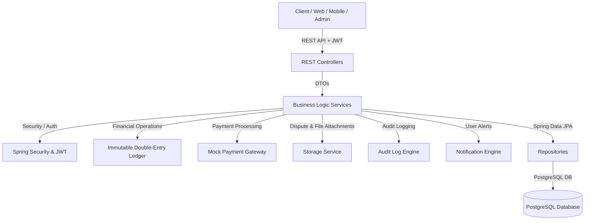
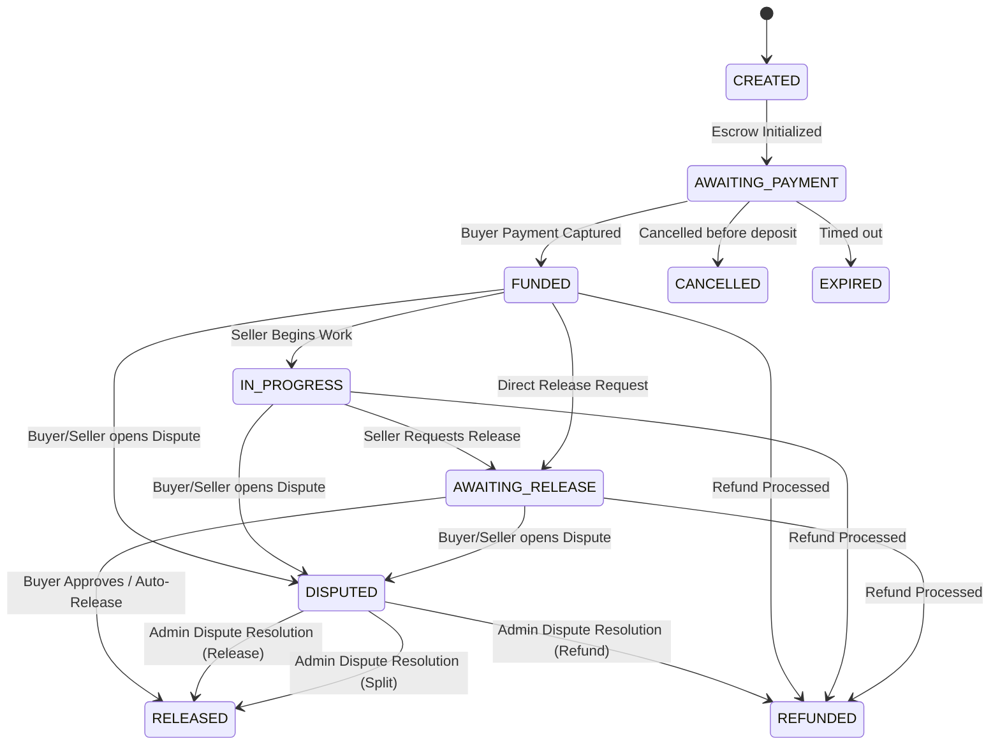
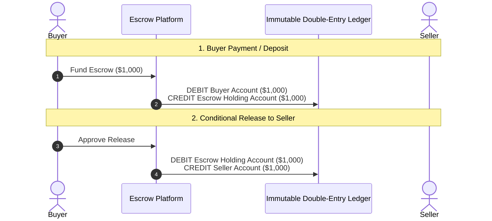

# Secure Java Spring Boot Escrow Platform

Production-ready digital escrow platform built with **Java 21**, **Spring Boot 3.3**, **PostgreSQL**, **Flyway**, **Spring Security JWT**, and an **Immutable Double-Entry Ledger**.

---

## 1. Core System Concept & Principles

The platform fundamentally operates as a secure digital escrow system based on the strict financial principle:

$$\text{Buyer Pays} \longrightarrow \text{Funds Held in Holding Ledger} \longrightarrow \text{Conditions Satisfied} \longrightarrow \text{Funds Released to Seller}$$

### Key Architectural Tenets
1. **Financial Integrity**: Money is never treated as a mutable scalar column on a user or escrow record. Every transaction is recorded as immutable, balanced debit and credit entries in a double-entry financial ledger.
2. **Idempotency & Double-Spend Protection**: Webhooks and payment endpoints require unique idempotency keys. Concurrency controls (pessimistic DB locking `@Lock(LockModeType.PESSIMISTIC_WRITE)` and optimistic JPA versioning `@Version`) prevent race conditions and duplicate fund releases.
3. **Auditability**: All state transitions, administrative actions, and payment processing trigger audit events with correlation IDs, user identifiers, and IP addresses.
4. **Dispute Safeguards**: Opening a dispute immediately freezes auto-release timers until an administrator resolves the dispute via refund, release, or split payout.

---

## 2. Architecture Overview & Diagrams



### Escrow State Machine Lifecycle



### Double-Entry Ledger Design

Every financial movement requires balanced debit and credit entries ($\sum \text{Debits} = \sum \text{Credits}$).



---

## 3. Technology Stack

* **Java 21**
* **Spring Boot 3.3.2** (Spring Web, Spring Data JPA, Spring Security, Validation, Actuator)
* **PostgreSQL 16**
* **Flyway Database Migrations**
* **JJWT (Java JWT 0.12.6)**
* **OpenAPI / Swagger UI (springdoc-openapi 2.6.0)**
* **Lombok**
* **JUnit 5 & Mockito**
* **Docker & Docker Compose**

---

## 4. API Specification & Endpoints

| Method | Endpoint | Description | Auth Role |
| :--- | :--- | :--- | :--- |
| **POST** | `/api/auth/register` | User Registration | Public |
| **POST** | `/api/auth/login` | User Login & JWT Retrieval | Public |
| **POST** | `/api/auth/password-reset` | Password Reset | Public |
| **GET** | `/api/users/me` | Fetch Current Authenticated User Profile | BUYER, SELLER, ADMIN |
| **POST** | `/api/escrows` | Create New Escrow Transaction | BUYER, SELLER |
| **GET** | `/api/escrows` | List Current User's Escrows (Paged) | BUYER, SELLER, ADMIN |
| **GET** | `/api/escrows/{id}` | Get Escrow Details | BUYER, SELLER, ADMIN |
| **GET** | `/api/escrows/ref/{referenceNumber}` | Get Escrow Details by Reference | BUYER, SELLER, ADMIN |
| **POST** | `/api/escrows/{id}/fund` | Fund Escrow Deposit | BUYER |
| **POST** | `/api/escrows/{id}/start-in-progress` | Seller Starts Work | SELLER, BUYER |
| **POST** | `/api/escrows/{id}/request-release` | Seller Requests Release | SELLER |
| **POST** | `/api/escrows/{id}/release` | Buyer Approves Release | BUYER |
| **POST** | `/api/escrows/{id}/refund` | Refund Escrow | BUYER, SELLER, ADMIN |
| **POST** | `/api/escrows/{id}/cancel` | Cancel Unfunded Escrow | BUYER, SELLER, ADMIN |
| **POST** | `/api/escrows/{id}/disputes` | Open Dispute on Escrow | BUYER, SELLER |
| **GET** | `/api/escrows/{id}/disputes` | Get Dispute for Escrow | BUYER, SELLER, ADMIN |
| **POST** | `/api/disputes/{id}/evidence` | Attach File Evidence to Dispute | BUYER, SELLER, ADMIN |
| **POST** | `/api/disputes/{id}/resolve` | Admin Resolve Dispute | ADMIN |
| **POST** | `/api/payments/webhook` | Process Idempotent Payment Webhook | Public (Webhook Secret) |
| **GET** | `/api/notifications` | Fetch In-App Notifications | BUYER, SELLER, ADMIN |
| **GET** | `/api/admin/users` | List Users | ADMIN |
| **GET** | `/api/admin/escrows` | View All System Escrows | ADMIN |
| **GET** | `/api/admin/audit-logs` | Review System Audit Logs | ADMIN |
| **GET** | `/api/admin/ledger/transactions` | Review Immutable Ledger Entries | ADMIN |
| **POST** | `/api/admin/cron/auto-release` | Trigger Auto-Release Sweep Job | ADMIN |

Interactive Swagger documentation is accessible at `http://localhost:8080/swagger-ui.html`.

---

## 5. Setup & Local Development Instructions

### Prerequisites
* JDK 21
* Maven 3.9+
* Docker & Docker Compose

### Running via Docker Compose
To start the PostgreSQL database and the Spring Boot application together:

```bash
docker-compose up --build
```

The application will be accessible at `http://localhost:8080`.

### Running Locally with Standalone Database
1. Start PostgreSQL locally or via docker:
   ```bash
   docker run --name escrow-postgres -e POSTGRES_DB=escrow_db -e POSTGRES_USER=escrow_user -e POSTGRES_PASSWORD=escrow_password -p 5432:5432 -d postgres:16-alpine
   ```
2. Run the Spring Boot application using Maven:
   ```bash
   mvn spring-boot:run -Dspring-boot.run.profiles=dev
   ```

### Running Automated Tests
Run unit, integration, and ledger balance tests:

```bash
mvn clean test
```

---

## 6. Environment Variables

| Variable | Description | Default / Example |
| :--- | :--- | :--- |
| `SPRING_PROFILES_ACTIVE` | Active Spring profile | `dev` / `test` / `prod` |
| `DATABASE_URL` | PostgreSQL JDBC URL | `jdbc:postgresql://localhost:5432/escrow_db` |
| `DATABASE_USERNAME` | Database username | `escrow_user` |
| `DATABASE_PASSWORD` | Database password | `escrow_password` |
| `JWT_SECRET` | Secret key for signing JWT tokens | `9a2f8c4e1b7d5a0e3f2c8b9a1d4e6f8c2b5a7d9e1f3c5b7a9d2e4f6c8b0a2d4e` |
| `PAYMENT_PROVIDER_API_KEY` | Payment Gateway API key | `mock_api_key_secret_12345` |
| `PAYMENT_WEBHOOK_SECRET` | Webhook verification secret | `mock_webhook_secret_67890` |
| `S3_ENDPOINT` | Object Storage S3 Endpoint | `http://localhost:9000` |
| `S3_ACCESS_KEY` | Object Storage Access Key | `minioaccesskey` |
| `S3_SECRET_KEY` | Object Storage Secret Key | `miniosecretkey` |

---

## 7. Security & Concurrency Design

### Financial Concurrency Controls
* **Pessimistic Locking**: `EscrowTransactionRepository.findByIdWithLock(UUID id)` utilizes `@Lock(LockModeType.PESSIMISTIC_WRITE)` during monetary operations (funding, releases, refunds, dispute resolutions) to block concurrent double-spending attempts.
* **Optimistic Versioning**: `EscrowTransaction` entity maintains a `@Version Long version` column to prevent lost updates across concurrent REST calls.
* **Idempotency Keys**: Payment webhooks and funding operations check `payment_events.idempotency_key` and `idempotency_keys` table to guarantee that duplicate webhooks will never credit or release funds twice.

---

## 8. Production Readiness & Compliance Notice

This platform implements software-level financial safety, auditability, double-entry ledgering, and idempotency guarantees. Before deploying this software into production for real money transfers, the following legal, regulatory, and financial compliance integrations must be performed:

1. **KYC / AML Integration**: Integration with licensed identity verification and sanction screening providers (e.g., Sumsub, Persona, ComplyAdvantage).
2. **Custody & Banking Rails**: Integration with FDIC-insured custodial bank accounts or regulated payment institution infrastructure (e.g., Stripe Connect Custom, Dwolla, Currencycloud).
3. **Regulatory Licensing**: Obtaining necessary Money Transmitter Licenses (MTL) or operating under a licensed sponsor bank / payment institution framework.
4. **Legal Escrow Agreements**: Formal legal review of digital escrow terms and dispute arbitration rules by licensed legal counsel.
